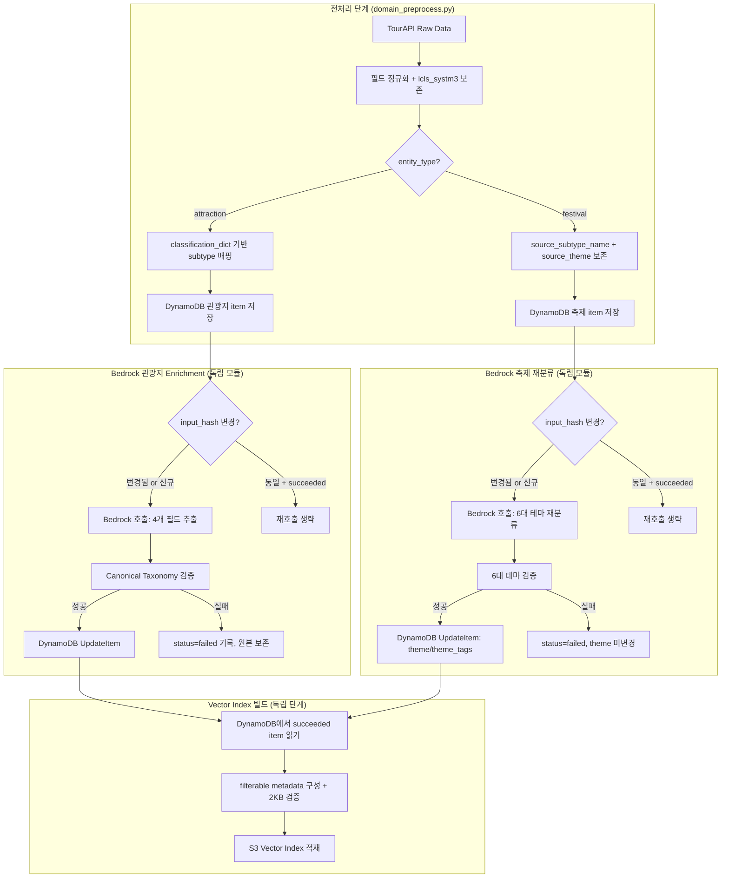

# Design Document: Bedrock Metadata Enrichment

## Overview

본 설계는 Lovv 여행 데이터 파이프라인에 두 가지 Bedrock LLM 호출 단계를 도입한다:

1. **관광지 메타데이터 보강 (Attraction Metadata Enrichment)**: `entity_type="attraction"` item에서 4개 의미 기반 필드(`indoor_outdoor`, `vibe_tags`, `experience_tags`, `companion_fit`)를 추출
2. **축제 테마 재분류 (Festival Theme Reclassification)**: `entity_type="festival"` item의 실제 내용을 기반으로 Lovv 6대 테마를 재분류

두 단계는 독립 모듈로 분리되며, 기존 전처리(`domain_preprocess.py`)에서 원천 분류 코드를 보존하고 결정론적 subtype 매핑을 수행한 후, 별도 실행 단계에서 Bedrock을 호출한다. Vector index 재빌드 시에는 DynamoDB에 확정된 결과만 읽고 Bedrock을 직접 호출하지 않는다.

### 설계 원칙

- DynamoDB item을 구조화 메타데이터의 기준 데이터(source of truth)로 사용
- 원천 데이터와 파생 데이터를 명확히 분리하고 출처를 추적
- LLM 결과는 파생 데이터로 취급하며 생성 이력을 함께 저장
- 실패 시 원본 보존 (fail-safe)
- `input_hash` 기반 중복 호출 방지
- S3 Vector filterable metadata 2KB 제한 준수

## Architecture



### 파이프라인 실행 순서

1. **전처리**: `domain_preprocess.py`에서 raw 데이터를 정규화하고 DynamoDB에 기본 item 저장
2. **관광지 Enrichment**: 독립 모듈이 attraction item을 배치 단위로 처리
3. **축제 재분류**: 독립 모듈이 festival item을 배치 단위로 처리
4. **Vector Index 빌드**: DynamoDB에서 확정된 결과만 읽어 S3 Vector 적재

각 단계는 독립 배포·실행이 가능하며, Vector 재빌드 시 Bedrock 재호출 없이 DynamoDB 상태만 참조한다.

## Components and Interfaces

### 1. 전처리 확장 (`domain_preprocess.py` 수정)

기존 `_build_domain_item()` 함수를 확장하여 원천 분류 코드를 보존하고 결정론적 subtype 매핑을 수행한다.

**책임:**
- `lcls_systm3` 추출 (common.lclsSystm3 → 최상위 lclsSystm3 fallback)
- `source_type` 상수 설정 (`"tourapi"`)
- `raw_s3_uri` 기록
- 관광지: `classification_dict.json` 기반 `attraction_subtype_code`/`name` 매핑
- 축제: `source_subtype_name`, `source_theme`, `program`, `subevent` 보존
- 미매핑 코드의 `classification_review` queue 처리

**인터페이스:**
```python
def extract_lcls_systm3(record: dict, detail: dict) -> str | None:
    """common.lclsSystm3 우선, 없으면 record 최상위 lclsSystm3 사용."""

def map_attraction_subtype(
    lcls_systm3: str | None,
    classification_dict: dict[str, Any],
) -> SubtypeMappingResult:
    """결정론적 subtype 매핑. 성공 시 code/name/source/version 반환."""

def preserve_festival_source(
    lcls_systm3: str | None,
    classification_dict: dict[str, Any],
    intro: dict[str, Any],
) -> FestivalSourceFields:
    """축제 원천 분류와 프로그램 정보 보존."""
```

### 2. Enrichment Engine (`src/kr_details_pipeline/enrichment_engine.py` 신규)

관광지 전용 Bedrock 메타데이터 추출 모듈.

**책임:**
- `entity_type="attraction"` 필터링
- 프롬프트 입력 구성 (허용 필드만, 12000자 제한)
- Bedrock `converse` API 호출 (최대 2회 재시도, 지수 백오프)
- 응답 JSON 파싱 및 Canonical Taxonomy 검증
- `input_hash` 기반 중복 호출 방지
- `metadata_enrichment` 이력 객체 관리
- DynamoDB 조건부 UpdateItem (성공 시만 파생 필드 저장)

**인터페이스:**
```python
@dataclass
class EnrichmentResult:
    status: Literal["succeeded", "failed", "skipped"]
    indoor_outdoor: str | None
    vibe_tags: list[str]
    experience_tags: list[str]
    companion_fit: list[str]
    metadata_enrichment: dict[str, Any]

def enrich_attraction(
    client: BedrockClient,
    item: dict[str, Any],
    *,
    model_id: str = DEFAULT_MODEL_ID,
    prompt_version: str = PROMPT_VERSION,
) -> EnrichmentResult:
    """단일 관광지 item에 대한 Bedrock enrichment 실행."""

def run_enrichment_batch(
    client: BedrockClient,
    items: list[dict[str, Any]],
    *,
    model_id: str,
    batch_size: int = 100,
) -> BatchResult:
    """배치 단위 enrichment. 500건 초과 시 자동 분할."""
```

### 3. Theme Classifier (`src/kr_details_pipeline/theme_classifier.py` 신규)

축제 전용 Bedrock 6대 테마 재분류 모듈.

**책임:**
- `entity_type="festival"` 필터링
- 프롬프트 입력 구성 (허용 필드만)
- Bedrock 호출 및 재시도
- 6대 테마 검증 (`primary_theme` + `theme_tags` 1-3개)
- `primary_theme`이 `theme_tags`에 없으면 자동 삽입
- `input_hash` 기반 중복 호출 방지
- `festival_theme_classification` 이력 객체 관리
- 실패 시 `source_theme` 자동 승격 금지

**인터페이스:**
```python
@dataclass
class ThemeClassificationResult:
    status: Literal["succeeded", "failed", "review_required"]
    primary_theme: str | None
    theme_tags: list[str]
    festival_theme_classification: dict[str, Any]

def classify_festival_theme(
    client: BedrockClient,
    item: dict[str, Any],
    *,
    model_id: str = DEFAULT_MODEL_ID,
    prompt_version: str = PROMPT_VERSION,
) -> ThemeClassificationResult:
    """단일 축제 item에 대한 테마 재분류 실행."""

def run_classification_batch(
    client: BedrockClient,
    items: list[dict[str, Any]],
    *,
    model_id: str,
    batch_size: int = 100,
) -> BatchResult:
    """배치 단위 재분류."""
```

### 4. Vector Metadata Builder 확장 (`src/kr_vector_index/metadata.py` 수정)

**책임:**
- filterable metadata allowlist에 enrichment 필드 추가
- `metadata_enrichment.status == "succeeded"`인 item만 enrichment 필드 포함
- None/빈 값 제거
- 2048 bytes 초과 시 배열 필드 뒤에서 trim
- 금지 필드(description, overview, metadata_enrichment 객체 등) 제외 보장

**인터페이스:**
```python
FILTERABLE_METADATA_KEYS = {
    # 기존 필드...
    "attraction_subtype_code",
    "indoor_outdoor",
    "vibe_tags",
    "experience_tags",
    "companion_fit",
    "schema_version",
}

def build_enriched_metadata(
    item: dict[str, Any],
) -> dict[str, Any]:
    """DynamoDB item에서 vector metadata 구성. 2KB 검증 포함."""

def trim_to_budget(
    metadata: dict[str, Any],
    budget: int = 2048,
) -> dict[str, Any] | None:
    """초과 시 배열 필드 뒤에서 trim. 실패 시 None 반환."""
```

### 5. 축제 월별 GSI 지원

**책임:**
- GSI Sort Key: `FESTIVAL#{month:02d}#{content_id}` 형식
- 기존 PK/SK 구조 불변
- `event_start_date` 없으면 month=`00`
- 여러 달 걸치는 축제는 시작 월 사용
- `festival_theme_classification.status` GSI 프로젝션

## Data Models

### DynamoDB 관광지 Item 스키마 (enrichment 완료 후)

```json
{
  "PK": "CITY#{city_name_en}",
  "SK": "ATTRACTION#{content_id}",
  "entity_type": "attraction",
  "content_id": "12345",
  "title": "예시 관광지",
  "description": "원문 설명...",
  "address": "경상북도 ...",
  "theme": "자연·트레킹",
  "theme_tags": ["자연·트레킹"],
  "experience_guide": "...",
  "opening_hours": "09:00~18:00",
  "closed_days": "매주 월요일",
  "parking": "무료주차 가능",

  "lcls_systm3": "NA010100",
  "source_type": "tourapi",
  "raw_s3_uri": "s3://lovv-raw-bucket/kr/attractions/12345.json",

  "attraction_subtype_code": "NA010100",
  "attraction_subtype_name": "산, 고개, 오름, 봉우리",
  "classification_source": "lcls_systm3",
  "classification_mapping_version": "2026-06-07",

  "indoor_outdoor": "outdoor",
  "vibe_tags": ["refreshing", "mountain_view", "open_view"],
  "experience_tags": ["walking", "photo_spot"],
  "companion_fit": ["family", "couple", "solo"],

  "schema_version": "2",
  "metadata_enrichment": {
    "status": "succeeded",
    "model_id": "openai.gpt-oss-120b-1:0",
    "prompt_version": "attraction-metadata-v2",
    "schema_version": "1",
    "generated_at": "2026-06-22T10:30:00Z",
    "input_hash": "sha256:abc123...",
    "error_code": null
  }
}
```

### DynamoDB 축제 Item 스키마 (재분류 완료 후)

```json
{
  "PK": "CITY#{city_name_en}",
  "SK": "FESTIVAL#{content_id}",
  "entity_type": "festival",
  "content_id": "2002",
  "title": "철원 한탄강 얼음트레킹 축제",
  "description": "한탄강 얼음 위를 걸으며...",
  "venue": "한탄강 일대",
  "playtime": "10:00~17:00",
  "event_start_date": "2026-01-15",
  "event_end_date": "2026-02-15",
  "month": 1,
  "visit_months": [1, 2],

  "lcls_systm3": "EV010100",
  "source_type": "tourapi",
  "raw_s3_uri": "s3://lovv-raw-bucket/kr/festivals/2002.json",
  "source_subtype_name": "문화관광축제",
  "source_theme": "예술·감성",
  "program": "얼음트레킹, 빙벽체험, 얼음낚시...",
  "subevent": "먹거리장터, 불꽃놀이",

  "theme": "자연·트레킹",
  "theme_tags": ["자연·트레킹", "온천·휴양"],

  "festival_theme_classification": {
    "status": "succeeded",
    "model_id": "openai.gpt-oss-120b-1:0",
    "prompt_version": "festival-theme-v1",
    "schema_version": "1",
    "generated_at": "2026-06-22T11:00:00Z",
    "input_hash": "sha256:def456...",
    "error_code": null
  }
}
```

### GSI 구조 (축제 월별 조회)

| GSI Name | Partition Key | Sort Key | Projected Attributes |
|---|---|---|---|
| FestivalMonthIndex | `entity_type` (= "festival") | `FESTIVAL#{month:02d}#{content_id}` | All + `festival_theme_classification.status` |

### input_hash 계산 규칙

**관광지:**
```python
fields = ["address", "closed_days", "description", "experience_guide",
           "opening_hours", "parking", "theme", "theme_tags", "title"]
# 키 알파벳순 정렬 → 값 공백 제거·소문자 변환 → SHA-256
```

**축제:**
```python
fields = ["content_id", "description", "entity_type", "lcls_systm3",
           "playtime", "program", "source_theme", "subevent", "title", "venue"]
# 키 알파벳순 정렬 → 값 공백 제거·소문자 변환 → SHA-256
```

### Canonical Taxonomy 정의

**vibe_tags** (최대 5개):
```
romantic, nostalgic, cozy, meditative, refreshing, inspiring,
calm, peaceful, healing, relaxing, serene, artistic, traditional, rustic,
open_view, panoramic_view, ocean_view, mountain_view, river_view,
lake_view, forest_view, sunrise_view, sunset_view, night_view,
flower_view, autumn_leaves, snow_view,
local, authentic, regional_culture, village_life, craft,
old_restaurant, local_market, small_town, rural, retro, community_based
```

**experience_tags** (최대 3개):
```
photo_spot, picnic, drive_course, walking, slow_travel,
cultural_experience, nature_observation, history_learning,
market_tour, hands_on_experience
```

**companion_fit** (최대 7개):
```
family, kids, couple, solo, pet, parents, seniors
```

**Lovv 6대 테마:**
```
바다·해안, 자연·트레킹, 미식·노포, 역사·전통, 예술·감성, 온천·휴양
```

**indoor_outdoor:**
```
indoor, outdoor, mixed, unknown
```

## Correctness Properties

*A property is a characteristic or behavior that should hold true across all valid executions of a system — essentially, a formal statement about what the system should do. Properties serve as the bridge between human-readable specifications and machine-verifiable correctness guarantees.*

### Property 1: lcls_systm3 추출 및 폴백

*For any* raw record (attraction 또는 festival), `extract_lcls_systm3`는 `common.lclsSystm3`가 존재하면 해당 값을 반환하고, 없으면 record 최상위의 `lclsSystm3` 값을 반환해야 한다. 둘 다 없으면 None을 반환해야 한다.

**Validates: Requirements 1.1, 1.2**

### Property 2: 결정론적 subtype 매핑

*For any* `lcls_systm3` 코드가 `classification_dict`에 존재하고 해당 entry의 `type`이 `Attraction`이면, `map_attraction_subtype`은 항상 동일한 `attraction_subtype_code`, `attraction_subtype_name`, `classification_source="lcls_systm3"`, `classification_mapping_version`을 반환해야 한다. 동일 코드를 여러 번 호출해도 결과가 변하지 않아야 한다.

**Validates: Requirements 2.1, 2.2, 2.5**

### Property 3: 미매핑 코드의 review queue 전송과 theme 보존

*For any* `lcls_systm3` 코드가 `classification_dict`에 없거나 해당 entry의 `type`이 `Attraction`이 아닌 관광지 item에 대해, subtype 필드(`attraction_subtype_code`, `attraction_subtype_name`, `classification_source`, `classification_mapping_version`)는 생성되지 않아야 하고, item의 `review_queues`에 `classification_review`가 추가되어야 하며, 기존 `theme`과 `theme_tags`는 변경 없이 보존되어야 한다.

**Validates: Requirements 2.3, 2.4**

### Property 4: 관광지 프롬프트 필드 경계

*For any* attraction item에 대해, `build_extraction_prompt`가 생성하는 프롬프트 문자열은 허용 필드(`entity_type`, `content_id`, `title`, `description`, `theme`, `theme_tags`, `experience_guide`, `opening_hours`, `closed_days`, `parking`, `address`)의 값만 포함해야 하고, 금지 필드(`PK`, `SK`, `source_key`, `raw_s3_uri`, `classification_source`, `classification_mapping_version`, `metadata_enrichment`)의 값은 포함하지 않아야 하며, 전체 길이가 12,000자를 초과하지 않아야 한다.

**Validates: Requirements 3.2, 3.3, 3.11**

### Property 5: Canonical Taxonomy 검증

*For any* Bedrock 응답 JSON에 대해, `validate_extracted_metadata`는: (a) 허용된 4개 출력 필드 외의 필드가 있으면 검증 오류를 발생시키고, (b) `indoor_outdoor`가 `{indoor, outdoor, mixed, unknown}` 외의 값이면 오류를 발생시키고, (c) `vibe_tags`에서 Canonical Taxonomy에 없는 태그를 제거하고 최대 5개로 제한하고, (d) `experience_tags`에서 비정규 태그를 제거하고 최대 3개로 제한하고, (e) `companion_fit`에서 비정규 값을 제거하고 최대 7개로 제한해야 한다.

**Validates: Requirements 3.4, 3.5, 3.6, 3.7, 3.8, 3.9**

### Property 6: input_hash 기반 중복 호출 방지

*For any* item에서 `input_hash`, `prompt_version`, `model_id`가 모두 이전 성공 실행(`status=succeeded`)과 동일하면, Bedrock 재호출을 생략하고 기존 결과를 유지해야 한다. 반대로 이전 `status`가 `failed` 또는 `skipped`이고 세 값 중 하나라도 변경되면, 재호출을 수행해야 한다.

**Validates: Requirements 4.4, 4.5, 4.6**

### Property 7: 실패 시 원본 item 보존 불변식

*For any* attraction item에서 Bedrock 호출 또는 schema 검증이 실패하면: (a) `metadata_enrichment` 객체만 갱신되고, (b) 파생 필드(`indoor_outdoor`, `vibe_tags`, `experience_tags`, `companion_fit`)는 저장되지 않으며, (c) 기존 원천/결정론적 필드(`title`, `description`, `theme`, `theme_tags`, `PK`, `SK`, `source_key`, `raw_s3_uri`, `classification_source`, `classification_mapping_version` 등)는 변경되지 않아야 한다.

**Validates: Requirements 5.1, 5.2, 5.3**

### Property 8: 축제 원천 분류 및 프로그램 보존

*For any* festival raw record에 대해, 전처리 후 DynamoDB item에는: (a) `lcls_systm3`가 dict에 있으면 `source_subtype_name`에 dict의 `name`, `source_theme`에 dict의 `theme`이 저장되고, (b) `intro.program`이 비어있지 않으면 `program` 필드에 저장되고, (c) `intro.subevent`가 비어있지 않으면 `subevent` 필드에 저장되어야 한다.

**Validates: Requirements 6.1, 6.2, 6.4, 6.5**

### Property 9: 축제 프롬프트 필드 경계

*For any* festival item에 대해, `build_festival_prompt`가 생성하는 프롬프트는 허용 필드(`entity_type`, `content_id`, `title`, `description`, `program`, `subevent`, `venue`, `playtime`, `lcls_systm3`, `source_theme`)만 포함하고, 금지 필드(`PK`, `SK`, `phone`, `tel`, `source_key`, `raw_s3_uri`, `festival_theme_classification`)를 포함하지 않아야 한다.

**Validates: Requirements 7.2, 7.3**

### Property 10: 축제 테마 출력 검증

*For any* Bedrock 축제 재분류 응답에 대해, `validate_festival_theme_output`는: (a) `primary_theme`이 Lovv 6대 테마 중 정확히 1개여야 하고, (b) `theme_tags`가 1~3개의 유효 테마로 구성되어야 하고, (c) `primary_theme`이 `theme_tags`에 포함되어야 하며(없으면 첫 번째 위치에 자동 삽입), (d) 6대 테마에 없는 값은 제거되고 유효 테마가 0개이면 실패로 처리되어야 한다.

**Validates: Requirements 7.4, 7.5, 7.6, 7.7**

### Property 11: 축제 재분류 시 원천 분류 보존

*For any* festival item에서 재분류가 성공하면 `theme`과 `theme_tags`가 갱신되되 `lcls_systm3`, `source_subtype_name`, `source_theme`은 변경 없이 보존되어야 한다. 재분류가 실패하면 `theme`과 `theme_tags`가 기존 값 그대로 유지되어야 하며, `source_theme`이 최종 `theme`으로 자동 승격되지 않아야 한다.

**Validates: Requirements 7.11, 8.3**

### Property 12: Vector metadata 계약

*For any* DynamoDB item에서 구성된 vector metadata에 대해: (a) `metadata_enrichment.status`가 `succeeded`가 아닌 item은 enrichment 파생 필드를 포함하지 않고, (b) `None`, 빈 문자열, 빈 배열 값은 포함하지 않고, (c) description, overview, embedding 원문, opening_hours, metadata_enrichment 전체 객체는 포함하지 않고, (d) filterable metadata의 UTF-8 인코딩 크기가 2048 bytes를 초과하지 않아야 하며, 초과 시 배열 필드를 뒤에서 trim하여 2048 bytes 이내로 축소해야 한다.

**Validates: Requirements 9.2, 9.3, 9.4, 9.5, 9.6, 9.7**

### Property 13: GSI SK 형식과 월 결정

*For any* festival item에 대해, GSI Sort Key는 `FESTIVAL#{month:02d}#{content_id}` 형식이어야 한다. `event_start_date`가 없으면 month는 `00`을 사용하고, 여러 달에 걸치는 축제는 시작 월을 사용해야 한다.

**Validates: Requirements 10.2, 10.5, 10.6**

### Property 14: 배치 분할과 장애 격리

*For any* 500건 초과의 item 목록에 대해, Enrichment_Engine은 최대 100건 단위 batch로 분할하여 순차 실행해야 하며, batch 내 일부 item 실패 시 실패 item을 건너뛰고 나머지를 계속 처리해야 한다.

**Validates: Requirements 11.4, 11.5**

## Error Handling

### Bedrock 호출 실패

| 오류 유형 | error_code | 처리 |
|---|---|---|
| 네트워크 타임아웃 | `timeout` | 최대 2회 재시도 (지수 백오프: 1초, 2초) |
| Bedrock 서비스 오류 (5xx) | `model_error` | 최대 2회 재시도 |
| Bedrock 스로틀링 (429) | `throttling` | 최대 2회 재시도 (더 긴 백오프) |
| JSON 파싱 실패 | `validation_error` | 재시도 없음, 즉시 실패 |
| Schema 검증 실패 | `validation_error` | 재시도 없음, 즉시 실패 |
| 모든 재시도 소진 | 원인별 코드 | `status=failed` 기록, 원본 보존 |

### 실패 시 동작 정책

**관광지 Enrichment 실패:**
1. `metadata_enrichment` 객체에 `status=failed`, `error_code`, `failed_at` 기록
2. 파생 필드(`indoor_outdoor`, `vibe_tags`, `experience_tags`, `companion_fit`) 저장 안 함
3. 원본 item의 모든 기존 필드 보존
4. 다음 item 처리 계속

**축제 재분류 실패:**
1. `festival_theme_classification` 객체에 `status=failed`, `error_code` 기록
2. 기존 `theme`, `theme_tags` 값 변경 없이 유지
3. `source_theme`을 최종 `theme`으로 자동 승격하지 않음
4. 다음 item 처리 계속

**근거 부족 처리:**
- 관광지: 4개 출력이 모두 `unknown`/빈 값 → `status=skipped`
- 축제: `description`, `program`, `subevent` 유효 텍스트가 모두 30자 미만 → `status=review_required`, `festival_theme_review` queue 추가

### 전처리 단계 오류

| 상황 | 처리 |
|---|---|
| `lcls_systm3` null/빈/미존재 | `classification_review` queue 추가, item 정상 저장 |
| `raw_s3_uri` 결정 불가 | 필드에 `"unknown"` 저장, 저장 계속 |
| `classification_dict`에 코드 없음 | subtype 필드 미생성, `classification_review` queue 추가 |

### Vector Metadata 오류

| 상황 | 처리 |
|---|---|
| Filterable metadata > 2048 bytes | 배열 필드 뒤에서 trim |
| Trim 후에도 초과 | 해당 item 오류 로그, metadata 생성 중단 |
| `metadata_enrichment.status` ≠ `succeeded` | enrichment 파생 필드 미포함 |

## Testing Strategy

### 테스트 프레임워크

- **단위 테스트**: `pytest` (기존 프로젝트 설정 활용)
- **속성 기반 테스트 (PBT)**: `hypothesis` (Python PBT 표준 라이브러리)
- **통합 테스트**: `moto` (AWS 서비스 모킹) + `pytest`

### Property-Based Testing 구성

Hypothesis를 사용하여 각 correctness property를 구현한다.

- 최소 100 iterations per property (`@settings(max_examples=100)`)
- 각 테스트에 설계 문서 property 참조 태그 포함
- 태그 형식: `# Feature: bedrock-metadata-enrichment, Property {number}: {title}`

### 테스트 구조

```
src/kr_details_pipeline/tests/
├── test_domain_preprocess.py          # 기존 테스트 확장
├── test_lcls_systm3_extraction.py     # Property 1: lcls_systm3 추출
├── test_subtype_mapping.py            # Property 2, 3: subtype 매핑
├── test_enrichment_engine.py          # Property 4, 5, 6, 7: enrichment
├── test_theme_classifier.py           # Property 8, 9, 10, 11: 축제 재분류
├── test_input_hash.py                 # Property 6: hash 계산
├── test_batch_processing.py           # Property 14: 배치 분할
src/kr_vector_index/tests/
├── test_metadata.py                   # Property 12: vector metadata
├── test_gsi_sk.py                     # Property 13: GSI SK 형식
```

### 단위 테스트 범위

단위 테스트는 다음 구체적 시나리오에 집중한다:

- Bedrock 재시도 동작 (mock client로 실패 후 성공 시나리오)
- 먹거리 부스/부대 공연/물놀이 축제 분류 규칙 (Requirement 7.8, 7.9, 7.10)
- `classification_review` queue 추가 로직
- 모듈 독립 호출 가능 여부 (Requirement 11.1, 11.2)
- Vector rebuild 시 Bedrock 미호출 (Requirement 11.3)
- 성공 item만 theme seed 검색 노출 (Requirement 8.5)

### 통합 테스트 범위

- DynamoDB 조건부 UpdateItem 동작 (`moto`)
- GSI 월별 range query 동작
- End-to-end: raw record → 전처리 → enrichment → vector metadata 생성

### Hypothesis Strategy 예시

```python
from hypothesis import given, settings, strategies as st

# 관광지 item 생성기
attraction_items = st.fixed_dictionaries({
    "entity_type": st.just("attraction"),
    "content_id": st.text(min_size=1, max_size=10, alphabet=st.characters(whitelist_categories=("Nd",))),
    "title": st.text(min_size=1, max_size=100),
    "description": st.text(min_size=0, max_size=5000),
    "theme": st.sampled_from(["자연·트레킹", "예술·감성", "역사·전통", "바다·해안", "미식·노포", "온천·휴양", ""]),
    "theme_tags": st.lists(st.sampled_from(["자연·트레킹", "예술·감성", "역사·전통"]), max_size=3),
    "experience_guide": st.text(max_size=500),
    "opening_hours": st.text(max_size=100),
    "closed_days": st.text(max_size=100),
    "parking": st.text(max_size=100),
    "address": st.text(max_size=200),
    # 금지 필드도 포함하여 필터링 검증
    "PK": st.text(min_size=1, max_size=50),
    "SK": st.text(min_size=1, max_size=50),
    "source_key": st.text(max_size=50),
    "raw_s3_uri": st.text(max_size=100),
    "metadata_enrichment": st.just({}),
})

# Bedrock 응답 생성기
bedrock_responses = st.fixed_dictionaries({
    "indoor_outdoor": st.sampled_from(["indoor", "outdoor", "mixed", "unknown", "invalid_value", ""]),
    "vibe_tags": st.lists(st.sampled_from(list(VIBE_TAG_VALUES) + ["invalid_tag"]), max_size=8),
    "experience_tags": st.lists(st.sampled_from(list(EXPERIENCE_TAG_VALUES) + ["bad"]), max_size=5),
    "companion_fit": st.lists(st.sampled_from(list(COMPANION_FIT_VALUES) + ["robot"]), max_size=10),
})
```

### 의존성 추가

```toml
[dependency-groups]
dev = [
    "pytest>=8.2,<9",
    "hypothesis>=6.100,<7",
    "moto[dynamodb,s3]>=5.0,<6",
]
```
