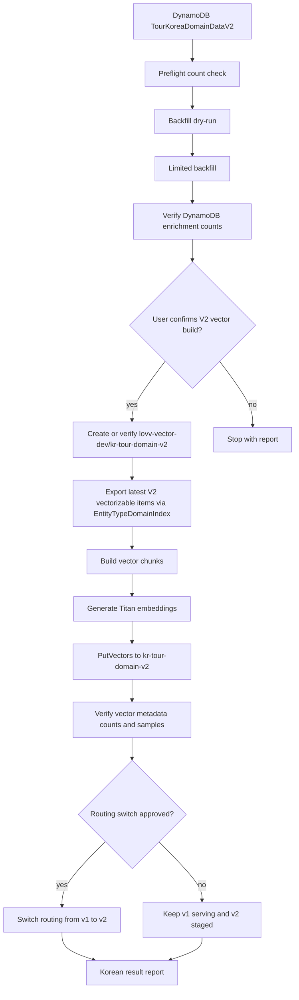

# Design Document: Enrichment Backfill and Vector Clean Rebuild

## Overview

본 설계는 기존 Bedrock enrichment engine의 결과를 최신 취득 데이터 기준 DynamoDB에 저장하는 persistence/backfill 단계를 추가하고, 그 결과를 반영하기 위해 같은 S3 Vector bucket 안에 V2 index를 신규 구축하는 방법을 정의한다.

기존 구현 상태는 다음과 같이 분리되어 있다.

- `src/kr_details_pipeline/enrichment_engine.py`: enrichment 결과 생성 가능
- `src/kr_vector_index/metadata.py`: `metadata_enrichment.status == "succeeded"`일 때만 enrichment metadata 복사 가능
- `src/kr_vector_index/chunks.py`: DynamoDB item에서 vector metadata 생성 가능
- 누락: `EnrichmentResult`를 DynamoDB에 안전하게 저장하는 단계
- 누락: 기존 V1 index를 보존한 채 신규 V2 index를 생성하고 검증 후 라우팅 전환하는 단계

현재 최신 취득 데이터 근거는 `docs/reports/kr_data_acquisition_report_20260628.md`와 `docs/reports/kr_nationwide_pipeline_report_20260628.md`다. 관광지/축제 원천은 `raw/KR/details/20260625/`, 방문자 통계는 2026-06-28 취득, 운영 적재 테이블은 `TourKoreaDomainDataV2`로 확인되었다. 실행 시점에는 이 근거가 여전히 최신인지 read-only로 재확인한다.

## Architecture



## Components

### 1. Persistence Adapter

Target module options:

- Preferred: `src/kr_details_pipeline/enrichment_persistence.py`
- Tests: `src/kr_details_pipeline/tests/test_enrichment_persistence.py`

Responsibilities:

- Convert `EnrichmentResult` into a DynamoDB `UpdateItem` request.
- Write success fields and history only for succeeded results.
- Write only history for failed/skipped results.
- Preserve all source and deterministic fields.

Interface sketch:

```python
def update_attraction_enrichment(
    client: DynamoClient,
    *,
    table_name: str,
    item: dict[str, Any],
    result: EnrichmentResult,
    item_schema_version: str = "2",
) -> None:
    """Persist one enrichment result using DynamoDB UpdateItem."""
```

Success update expression:

```text
SET indoor_outdoor = :indoor_outdoor,
    vibe_tags = :vibe_tags,
    experience_tags = :experience_tags,
    companion_fit = :companion_fit,
    schema_version = :item_schema_version,
    metadata_enrichment = :metadata_enrichment
```

Failure/skipped update expression:

```text
SET metadata_enrichment = :metadata_enrichment
```

The adapter must use `PK` and `SK` from the current item as the key. It must not issue `PutItem`.

### 2. Backfill Runner

Target module options:

- Preferred CLI/script: `scripts/backfill_enrichment.py`
- Reuse source logic from `src/kr_vector_index/export.py` where possible.

Responsibilities:

- Read attraction items from `TourKoreaDomainDataV2`.
- Confirm that `TourKoreaDomainDataV2` reflects the latest acquired KR dataset before write execution.
- Support bounded execution and resume.
- Call `enrich_attraction()`.
- Persist result through the Persistence Adapter.
- Emit a JSON summary.

Command shape:

```bash
UV_CACHE_DIR=.cache/uv uv run python scripts/backfill_enrichment.py \
  --profile skn26_final \
  --region us-east-1 \
  --table-name TourKoreaDomainDataV2 \
  --limit 50 \
  --dry-run
```

Limited real run shape:

```bash
UV_CACHE_DIR=.cache/uv uv run python scripts/backfill_enrichment.py \
  --profile skn26_final \
  --region us-east-1 \
  --table-name TourKoreaDomainDataV2 \
  --limit 50
```

Full run is allowed only after limited-run review.

### 3. Vector V2 Build Controller

Existing module:

- `src/kr_unified_pipeline/vector_rebuilder.py`

Current limitation:

- It exports items and calls `put_vectors_sdk()`.
- It does not delete old vectors.
- Therefore `mode="full"` is currently a full upsert, not a clean rebuild when targeting an existing index.

Chosen strategy:

1. **Same-bucket V2 index strategy**
   - Keep `lovv-vector-dev/kr-tour-domain-v1` available as the rollback index.
   - Create or target `lovv-vector-dev/kr-tour-domain-v2`.
   - Reapply the existing index configuration: float32, 1024 dimensions, cosine distance, and non-filterable metadata keys `raw_s3_uri`, `ddb_pk`, `ddb_sk`, `embedding_model`.
   - Write rebuilt vectors from the latest `TourKoreaDomainDataV2` source into the V2 index.
   - Validate counts, sample metadata, filterability, and query behavior before routing changes.

2. **Existing V2 index conflict handling**
   - List indexes in `lovv-vector-dev` before creation.
   - If `kr-tour-domain-v2` does not exist, create it.
   - If `kr-tour-domain-v2` already exists, stop and ask whether to delete/recreate that V2 target or use a different target name.
   - Never delete or recreate `kr-tour-domain-v1` as part of this spec.

The initial implementation should expose a dry-run that reports:

- previous index vector count
- target index existence and configuration
- desired vector count
- expected write count
- expected enrichment metadata coverage

Destructive deletion or index recreation of an existing V2 target must not run without explicit user confirmation. V1 deletion/recreation is out of scope.

### 4. Report Writer

Target file pattern:

- `docs/reports/enrichment_backfill_vector_rebuild_YYYYMMDD.md`

The report must include:

- branch
- source table
- previous vector index
- target vector index
- pre/post DynamoDB counts
- previous/target S3 Vector counts
- command list
- sample metadata evidence
- failures and retry plan
- whether V2 index build and routing switch were performed

## Data Contract

### DynamoDB Attraction Item After Success

```json
{
  "PK": "CITY#GANGNEUNG",
  "SK": "ATTRACTION#2706354",
  "entity_type": "attraction",
  "content_id": "2706354",
  "indoor_outdoor": "outdoor",
  "vibe_tags": ["refreshing", "ocean_view"],
  "experience_tags": ["photo_spot", "walking"],
  "companion_fit": ["family", "couple"],
  "schema_version": "2",
  "metadata_enrichment": {
    "status": "succeeded",
    "model_id": "openai.gpt-oss-120b-1:0",
    "prompt_version": "attraction-metadata-v2",
    "schema_version": "1",
    "generated_at": "2026-06-28T00:00:00Z",
    "input_hash": "sha256:..."
  }
}
```

### Vector Metadata After Rebuild

Allowed enrichment-derived fields:

- `indoor_outdoor`
- `vibe_tags`
- `experience_tags`
- `companion_fit`
- `schema_version`

Forbidden vector metadata field:

- `metadata_enrichment`

## Error Handling

- Missing `PK` or `SK`: record failure, skip write.
- Bedrock validation failure: write `metadata_enrichment.status="failed"` only.
- Throttling or timeout: retry according to existing `enrich_attraction()` policy.
- Three consecutive Bedrock/DynamoDB failures: stop and report resume cursor.
- Vector V2 index creation denied: stop and report permission or IAM blocker.
- Existing V2 target delete/recreate denied: stop and report permission blocker; do not fall back to unsafe partial rebuild silently.
- V1 deletion/recreation request: stop because Previous_Vector_Index mutation is out of scope for this spec.

## Verification Strategy

### Local Tests

```bash
UV_CACHE_DIR=.cache/uv uv run python -m pytest \
  src/kr_details_pipeline/tests/test_enrichment_persistence.py \
  src/kr_vector_index/tests/test_metadata.py \
  -q --basetemp .cache/pytest-tmp -p no:cacheprovider
```

### Live Read-Only Checks

Before backfill:

```bash
aws dynamodb scan \
  --table-name TourKoreaDomainDataV2 \
  --select COUNT \
  --filter-expression 'entity_type = :attr AND attribute_exists(metadata_enrichment)' \
  --expression-attribute-values '{":attr":{"S":"attraction"}}' \
  --profile skn26_final \
  --region us-east-1
```

After rebuild:

```bash
aws s3vectors list-vectors \
  --vector-bucket-name lovv-vector-dev \
  --index-name kr-tour-domain-v2 \
  --return-metadata \
  --profile skn26_final \
  --region us-east-1
```

## Security and Safety

- No secrets may be committed.
- `.env` and real AWS credentials must not be read or staged.
- Existing V2 target deletion/recreation requires explicit user confirmation.
- Existing V1 index deletion/recreation is not allowed in this spec.
- V1 table updates require explicit user confirmation.
- Backfill must default to bounded/dry-run execution before full-table work.
- Full `metadata_enrichment` must never be stored in vector metadata.
- IAM/resource policies for `kr-tour-domain-v2` must be verified before routing traffic to it.

## Migration and Rollout

1. Implement local tests for the persistence adapter.
2. Implement persistence adapter.
3. Implement dry-run backfill runner.
4. Run dry-run against V2.
5. Run limited V2 backfill.
6. Verify DynamoDB field counts.
7. Ask user to approve full V2 backfill.
8. Run full V2 backfill.
9. Ask user to approve same-bucket V2 vector build.
10. Create or verify `lovv-vector-dev/kr-tour-domain-v2`.
11. Build vectors from latest `TourKoreaDomainDataV2` into `kr-tour-domain-v2`.
12. Verify vector metadata and query behavior.
13. Ask user to approve routing switch from `kr-tour-domain-v1` to `kr-tour-domain-v2`.
14. Ask user whether AgentCore V1 index should be rebuilt.
