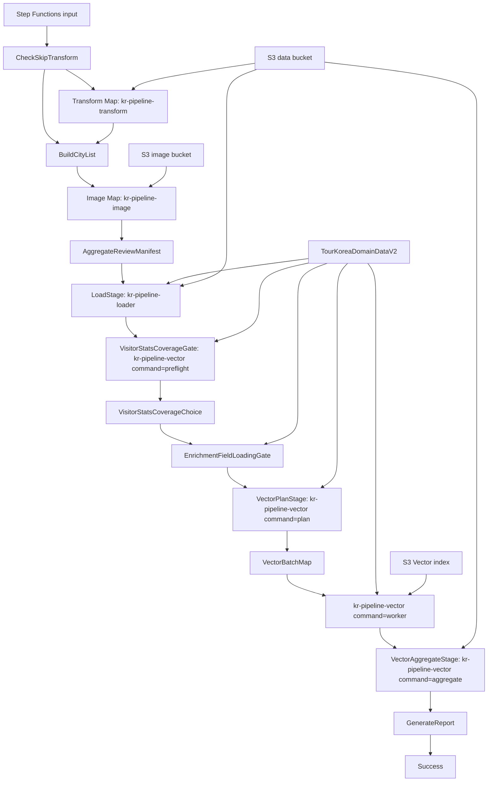

# Design Document: KR Lambda/SFN Batch Reset

## Overview

본 설계는 KR 데이터 파이프라인에서 반복적으로 발생한 Lambda/Step Functions wiring 누락을 해결하기 위해 실행 계층을 통제된 단위로 재구성한다. DynamoDB와 S3 데이터 계층은 보존하고, Lambda functions, Lambda layers, Step Functions state machine, IAM invoke policy를 하나의 execution plane으로 정리한다.

핵심 설계 결정은 다음과 같다.

1. 수동 삭제가 아니라 Terraform-managed reset으로 진행한다.
2. Lambda Layer는 dependency packaging 정리용으로만 사용한다.
3. vector timeout 해결은 Step Functions Map 및 batch worker 구조로 처리한다.
4. `kr-pipeline-loader`는 load만 담당하고, vector rebuild 책임을 제거한다.
5. live drift 검증과 Terraform plan 검토를 apply 전 필수 gate로 둔다.
6. `visitor_statistics` coverage는 vector 문제가 아니라 DynamoDB/DataLab 적재 문제로 별도 검증한다.
7. 현재 브랜치 `investigate/enrichment-field-loading-20260628`의 enrichment field loading/backfill 의도를 vector rebuild 선행 조건으로 보존한다.

## Current State

현재 실행 계층은 다음 문제가 있다.

- `kr-pipeline-loader`는 원래 load와 vector-build command를 함께 가진다.
- live Step Functions `VectorStage`는 loader Lambda의 `vector-build` command를 호출한다.
- local Terraform은 `VectorStage`를 `kr-pipeline-vector`로 바꾸었지만 live state machine에는 반영되지 않았다.
- `kr-pipeline-loader` vector-build는 CloudWatch에서 900초 timeout을 기록했다.
- `kr-pipeline-vector`도 full build를 단일 invocation으로 수행하므로 large rebuild에는 timeout 위험이 남는다.
- `kr-pipeline-image`만 requests Lambda Layer를 사용하고, transform/loader/vector는 layer를 사용하지 않는다.
- `visitor_statistics`는 2026-06-30 보완 후 live `TourKoreaDomainDataV2`에 2,820건, 235개 도시 x 12개월이 적재되어야 하며, 잔여 5개 legacy/obsolete city PK 60건은 별도 의사결정 대상이다.
- `visitor_statistics`는 `SK=STAT#{YYYYMM}`, `domain_sort_key=STAT#{YYYYMM}`, `gsi_sk` 없음, vector 제외가 현재 계약이다.
- enrichment loading/backfill은 별도 Kiro spec `enrichment-backfill-vector-rebuild`와 현재 브랜치명에 의해 추적되고 있으며, reset 작업 중 누락되면 vector metadata enrichment field가 다시 0건 상태로 남을 수 있다.

## Target Architecture



## Resource Strategy

### Protected resources

The following resources are protected and must not be deleted by this reset.

- DynamoDB tables, including `TourKoreaDomainDataV2`
- S3 data bucket `lovv-data-pipeline-dev-925273580929`
- S3 image bucket `lovv-pipeline-images-dev-925273580929`
- S3 object prefixes under raw, processed, review, failed, quality, image, and vector manifest paths
- S3 Vector bucket `lovv-vector-dev`
- Existing S3 Vector indexes unless explicitly approved
- `TourKoreaDomainDataV2` `visitor_statistics` rows and existing enrichment fields
- DataLab raw object `raw/KR/datalab/20260629/visitor_statistics_2025.json`

### Rebuilt resources

The following resources are in reset scope.

- `kr-pipeline-transform`
- `kr-pipeline-image`
- `kr-pipeline-loader`
- `kr-pipeline-vector` or replacement vector planner/worker/aggregator functions
- Lambda layers used by these functions
- `kr-data-pipeline-dev` Step Functions state machine definition
- Lambda/SFN IAM policies needed by the new execution graph

### Log groups

CloudWatch log groups should be retained by default for audit continuity. If function names are replaced, new log groups may be added while old log groups remain until the user approves cleanup.

## Lambda Design

### Transform Lambda

Name: `kr-pipeline-transform`

Responsibilities:

- Read one raw KR detail JSON.
- Run preprocessing.
- Write processed `passed/`, `review/`, `failed/`, `quality/`.
- Avoid vector responsibilities.

Open design choice:

- Whether image S3 rewrite stays inside transform for legacy compatibility or moves fully to `kr-pipeline-image`.
- Preferred direction is to keep transform focused and make image handling explicit in ImageStage.

### Image Lambda

Name: `kr-pipeline-image`

Responsibilities:

- Download/upload primary images.
- Produce review image manifest.
- Generate image-related reports.
- Own future `alternative_image_url` handling if it becomes an operating pipeline field.

Layer:

- Attach requests/http dependency layer only if the image code requires it.

### Loader Lambda

Name: `kr-pipeline-loader`

Responsibilities:

- Read `processed/KR/details/{ingest_date}/passed/`.
- Load items into DynamoDB.
- Return load counts and failure details.

Explicitly removed:

- Full vector-build command.
- Bedrock embedding calls.
- S3 Vector upsert.

### Visitor Statistics Coverage Gate

This gate is a read-only verification and optional guarded backfill checkpoint before vector rebuild. It must not be treated as part of the vector worker.

Responsibilities:

- Count live `entity_type="visitor_statistics"` rows in `TourKoreaDomainDataV2`.
- Verify 2,820 rows for 235 city PKs x 12 months unless a newer approved count exists.
- Verify the residual five city PKs without DataLab rows are documented.
- Verify `SK=STAT#{YYYYMM}`, `domain_sort_key=STAT#{YYYYMM}`, and absence of `gsi_sk`.
- Verify the DataLab raw contract path `raw/KR/datalab/20260629/visitor_statistics_2025.json`.
- Keep `visitor_statistics` excluded from vectorization.

If the gate fails, the workflow stops before full vector rebuild. The fix path is DataLab/raw/preprocess/backfill, not S3 Vector rebuild.

### Enrichment Field Loading Gate

This gate preserves the current branch intent from `investigate/enrichment-field-loading-20260628`.

Responsibilities:

- Count `metadata_enrichment` and each top-level enrichment derived field in `TourKoreaDomainDataV2`.
- Verify `src/kr_details_pipeline/enrichment_persistence.py` and `scripts/backfill_enrichment.py` remain in scope when reset work touches vector rebuild.
- Verify succeeded enrichment writes `indoor_outdoor`, `vibe_tags`, `experience_tags`, `companion_fit`, and `schema_version`.
- Verify failed/skipped enrichment does not overwrite unrelated fields.
- Verify vector metadata includes allowed enrichment derived fields only for `metadata_enrichment.status="succeeded"`.
- Verify vector metadata never includes the full `metadata_enrichment` object.

If the gate finds zero or unknown enrichment counts, the completion report must not claim enrichment-complete vector rebuild.

### Vector Planner Lambda

Current Terraform target: `kr-pipeline-vector` with `command="plan"`.

Future candidate name if the user approves separate functions: `kr-pipeline-vector-planner`.

Responsibilities:

- Read source table and determine vectorizable item count.
- Exclude `visitor_statistics`.
- Include enrichment field counts in the plan summary.
- Create batch descriptors.
- Write batch manifest to S3.
- Return batch list to Step Functions.

Batch descriptor shape:

```json
{
  "batch_id": "kr-vector-20260630-0001",
  "table_name": "TourKoreaDomainDataV2",
  "entity_index_name": "EntityTypeDomainIndex",
  "vector_bucket": "lovv-vector-dev",
  "index_name": "kr-tour-domain-v2",
  "start_key_s3_uri": "s3://...",
  "limit": 500
}
```

The exact cursor representation can be DynamoDB ExclusiveStartKey, S3 item manifest slices, city/entity partitions, or a generated item-key list. The implementation must make retrying one batch deterministic.

### Vector Worker Lambda

Current Terraform target: `kr-pipeline-vector` with `command="worker"`.

Future candidate name if the user approves separate functions: `kr-pipeline-vector-worker`.

Responsibilities:

- Read one batch descriptor.
- Fetch only assigned items.
- Build chunks.
- Generate Titan embeddings.
- Upsert vectors to S3 Vector index in batches of 500 or less.
- Return a compact result.

Result shape:

```json
{
  "batch_id": "kr-vector-20260630-0001",
  "items_read": 500,
  "chunks_created": 500,
  "vectors_upserted": 498,
  "failed_count": 2,
  "retryable": true,
  "errors_s3_uri": "s3://..."
}
```

### Vector Aggregator Lambda

Current Terraform target: `kr-pipeline-vector` with `command="aggregate"`.

Future candidate name if the user approves separate functions: `kr-pipeline-vector-aggregator`.

Responsibilities:

- Aggregate all batch results.
- Write final manifest to S3.
- Mark full rebuild status as succeeded, partial, or failed.
- Provide failed batch ids for retry.

## Step Functions Design

The final state machine should use these major states.

1. `CheckSkipTransform`
2. `TransformStage` Map
3. `BuildCityList`
4. `ImageStage` Map
5. `AggregateReviewManifest`
6. `LoadStage`
7. `VisitorStatsCoverageGate`
8. `VisitorStatsCoverageChoice`
9. `EnrichmentFieldLoadingGate`
10. `VectorPlanStage`
11. `VectorBatchStage` Map
12. `VectorAggregateStage`
13. `GenerateReport`
14. `Success`

### VectorBatchStage Map

`VectorBatchStage` must bound concurrency. Initial default should be conservative, for example `MaxConcurrency = 5`, until Bedrock and S3 Vectors throughput are verified.

The Map state should preserve batch-level failures instead of losing all progress. If Inline Map state output risks the Step Functions 256 KB payload limit, worker results should be written to S3 and the state output should carry only S3 URIs.

## Terraform Design

The reset should be represented as Terraform changes. The exact implementation can use one of two safe approaches.

### Option A: replace in place

- Keep existing names for transform, image, loader.
- Remove vector-build from loader package.
- Add planner/worker/aggregator functions.
- Update Step Functions definition.

Pros:

- Smaller routing change.
- Existing external references remain valid for transform/image/loader.

Cons:

- Old function names may hide changed responsibilities.

### Option B: new vector execution names

- Keep transform/image/loader names.
- Add explicit vector planner/worker/aggregator names.
- Optionally retire `kr-pipeline-vector` or make it planner-only.

Pros:

- Clear responsibility split.
- Easier audit of Step Functions wiring.

Cons:

- Requires IAM and output updates.

Selected pre-apply Terraform approach: keep transform/image/loader names stable and use the existing `kr-pipeline-vector` Lambda as the explicit command surface for `preflight`, `plan`, `worker`, and `aggregate`. Option B remains the clearer future split if the user approves separate planner/worker/aggregator function names.

## Rollout Strategy

### Phase 0: Baseline and backup

- Capture Lambda configurations.
- Capture Step Functions definition.
- Capture layer versions.
- Capture IAM policy statements.
- Capture current branch name.
- Capture `visitor_statistics` count, city coverage, key-shape checks, and DataLab raw path evidence.
- Capture enrichment field counts in DynamoDB and current vector metadata.
- Capture Terraform plan before edits if useful.
- Write baseline report.

### Phase 0.5: data completeness gates

- Run visitor statistics coverage gate.
- Run enrichment field loading gate.
- Stop if visitor statistics coverage or enrichment field loading evidence contradicts the approved reset scope.
- Record whether vector smoke test will run in enrichment-complete or non-enrichment-complete mode.

### Phase 1: Terraform graph rewrite

- Add vector planner/worker/aggregator resources.
- Add needed layer resources.
- Update Step Functions states.
- Update IAM invoke permissions.
- Remove loader vector-build routing.
- Keep protected data resources untouched.

### Phase 2: local validation

- `terraform fmt -check`
- `terraform validate`
- focused Python tests
- static inspection of state machine JSON

### Phase 3: plan review

- Run `terraform plan`.
- Verify no DynamoDB/S3 protected deletes.
- Verify Lambda/SFN replacements match approved scope.
- Stop for user approval.

### Phase 4: apply and smoke test

- Apply approved plan.
- Invoke planner with small limit.
- Run one or two vector worker batches.
- Verify S3 manifest and S3 Vector sample.
- Verify `visitor_statistics` remains excluded.
- Verify enrichment metadata rules on sampled vectors.
- Stop before full vector rebuild.

### Phase 5: full vector rebuild

- Run full vector Map only after smoke test approval.
- Verify counts and sample queries.
- Write completion report.

## Verification Strategy

### Static verification

```powershell
terraform -chdir=infrastructure/terraform fmt -check
terraform -chdir=infrastructure/terraform validate
```

### Python verification

```powershell
$env:UV_CACHE_DIR='.cache\uv'
uv run python -m pytest src\kr_vector_index\tests src\kr_unified_pipeline\tests\test_vector_rebuilder.py --basetemp .cache\pytest-tmp -p no:cacheprovider
```

### Visitor statistics verification

```powershell
$env:UV_CACHE_DIR='.cache\uv'
uv run python -m pytest src\kr_details_pipeline\tests\test_visitor_statistics_backfill.py src\kr_details_pipeline\tests\test_load.py src\kr_details_pipeline\tests\test_domain_preprocess.py src\kr_vector_index\tests\test_export.py --basetemp .cache\pytest-tmp -p no:cacheprovider
```

### Enrichment loading verification

```powershell
$env:UV_CACHE_DIR='.cache\uv'
uv run python -m pytest src\kr_details_pipeline\tests\test_enrichment_persistence.py src\kr_details_pipeline\tests\test_backfill_enrichment.py src\kr_details_pipeline\tests\test_enrich_attraction.py src\kr_vector_index\tests --basetemp .cache\pytest-tmp -p no:cacheprovider
```

### Live read-only verification

```powershell
aws lambda get-function-configuration --function-name kr-pipeline-loader --region us-east-1
aws lambda get-function-configuration --function-name kr-pipeline-vector --region us-east-1
aws stepfunctions describe-state-machine --state-machine-arn arn:aws:states:us-east-1:925273580929:stateMachine:kr-data-pipeline-dev --region us-east-1
```

### Plan verification

The plan must be reviewed for:

- no DynamoDB table deletes
- no S3 bucket deletes
- no S3 object deletes
- expected Lambda creates/replaces
- expected Step Functions definition update
- expected IAM policy update
- visitor statistics rows are not deleted or recreated by Terraform
- enrichment loading/backfill scripts and tests are not dropped from the branch

### Smoke test

The smoke test must run a limited vector plan and worker batch. It must not run full vector rebuild until user approval.

The smoke test must record whether enrichment fields were expected in the sampled batch. If enrichment baseline is zero or unknown, the smoke test may verify wiring and timeout behavior, but the report must not claim enrichment metadata completion.

## Security and Safety

- Do not read or commit `.env` files.
- Do not print AWS secrets.
- Do not manually delete AWS resources outside Terraform.
- Do not apply Terraform before protected-resource review.
- Do not run full vector rebuild until limited batch passes.
- Do not run full vector rebuild before visitor statistics coverage and enrichment loading gates are reported.
- Do not increase Map concurrency without Bedrock/S3 Vector error evidence.
- Do not delete old vector indexes without explicit target approval.
- Do not use vector rebuild as the remediation path for missing `visitor_statistics`.

## Open Decisions

- New vector function naming.
- Batch descriptor storage format.
- Initial batch size.
- Initial Map concurrency.
- Whether transform image rewrite remains for backward compatibility.
- Whether old `kr-pipeline-vector` becomes planner or is replaced by explicit planner/worker/aggregator functions.
- Whether the five residual legacy/obsolete visitor statistics city PKs should be retained or deprecated.
- Whether enrichment backfill must complete before first vector smoke test or before full vector rebuild only.
