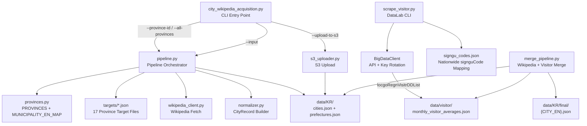

# Design Document: KR Nationwide Data Reacquisition

## Overview

This feature extends the South Korea city data acquisition pipeline from a limited scope (강원·경북 only, 18 Wikipedia cities, 40 DataLab cities) to nationwide coverage of all ~226 municipalities across all 17 provinces.

The design builds on the existing `crawling/KR/` architecture (Wikipedia pipeline, normalizer, provinces, target files, S3 uploader) and the DataLab visitor collector (`.cache/tour_api_korea_repo/scripts/scrape_and_aggregate_visitor.py`). The extension requires:

1. **CLI enhancements** — `--province-id` and `--all-provinces` flags for batch orchestration
2. **Target file completeness** — all 17 province target files already exist; validate they cover MUNICIPALITY_EN_MAP
3. **Province-aware batch processing** — sequential province iteration with incremental merge
4. **Nationwide DataLab collection** — complete signguCode mapping, resumable month-by-month queries
5. **Merge strategy** — combine Wikipedia metadata + visitor statistics into unified output
6. **Robustness** — API key rotation, retry with backoff, incremental persistence on failure

## Architecture



### Execution Flow

1. **Province-level Wikipedia acquisition**: CLI receives `--province-id KR-11` or `--all-provinces`. Pipeline resolves target file(s), fetches Wikipedia pages, normalizes to CityRecords, and incrementally merges into `data/KR/cities.json`.

2. **Nationwide DataLab collection**: The DataLab collector loads a nationwide signguCode mapping, iterates 12 months, queries the API with key rotation, filters by signguCode, aggregates daily→monthly, and outputs `data/visitor/monthly_visitor_averages.json`.

3. **Merge step**: A merge utility embeds visitor_statistics into each city's final output file, preserving partial data when one source is unavailable.

4. **S3 upload**: On `--upload-to-s3`, uploads cities.json and prefectures.json with checksum deduplication.

## Components and Interfaces

### 1. CLI Layer (`city_wikipedia_acquisition.py`)

**New arguments:**
- `--province-id <KR-XX>` — Process a single province by ID
- `--all-provinces` — Process all 17 provinces sequentially
- `--force-refresh` — Re-collect even if data exists (passed through to DataLab)

**Resolution logic:**
```python
PROVINCE_TARGET_MAP: dict[str, str] = {
    "KR-11": "seoul_municipalities_ko.json",
    "KR-26": "busan_municipalities_ko.json",
    # ... all 17 provinces
}
```

When `--province-id` is specified, the CLI resolves the target file path from `PROVINCE_TARGET_MAP`, sets `default_prefecture_id` to the province ID, and calls `acquire_city_data`. When `--all-provinces` is specified, it iterates all entries in sequence.

### 2. Pipeline Orchestrator (`pipeline.py`)

**Existing behavior (preserved):**
- `load_targets(path, titles, default_lang, default_prefecture_id)` → `list[PageTarget]`
- `acquire_city_data(titles, output_dir, client, source_lang)` → merges into existing cities.json

**New behavior:**
- `acquire_province(province_id, output_dir, client)` — convenience function that resolves target file and calls `acquire_city_data` with the correct `default_prefecture_id`
- `acquire_all_provinces(output_dir, client)` — iterates all 17 provinces, logs progress per province
- **Failure isolation**: If a Wikipedia fetch fails for one municipality, catch the exception, log it, continue with remaining municipalities in the province, and persist all successful records before returning

**Progress tracking:**
```python
@dataclass
class ProvinceResult:
    province_id: str
    newly_acquired: int
    skipped: int  # already in cities.json
    failed: int
    failed_titles: list[str]
```

### 3. Normalizer (`normalizer.py`)

No structural changes needed. The existing `build_city_record` and `city_field_status` functions already handle:
- Minimum field extraction (city_name_ko, prefecture_id, location, description)
- Nominatim fallback for missing coordinates
- Climate table placeholder with STATUS_NEEDS_REVIEW
- field_status population
- data_confidence assignment

### 4. Province Registry (`provinces.py`)

**Existing (already complete):**
- `PROVINCES` tuple — all 17 provinces with ISO codes, Korean/English names, regions
- `MUNICIPALITY_EN_MAP` — ~226 entries covering all municipalities with disambiguation
- `detect_province()` / `find_province()` — lookup utilities

**Validation function (new):**
```python
def validate_target_coverage(targets_dir: Path) -> list[str]:
    """Return municipality names from MUNICIPALITY_EN_MAP not found in any target file."""
```

### 5. DataLab Collector (refactored from `.cache/tour_api_korea_repo/scripts/`)

**Module: `crawling/KR/datalab_collector.py`** (new, extracted from script)

**Components:**
- `BigDataClient` — API client with key rotation (moved from script, cleaned up)
- `SignguCodeMapping` — loads/validates the nationwide signguCode→city mapping
- `collect_visitor_statistics(year, mapping, client, output_path, force_refresh)` — main orchestrator
- `aggregate_monthly(daily_records)` — pure function for daily→monthly aggregation

**signguCode mapping file:** `crawling/KR/signgu_codes.json`
```json
{
  "1100000000": {"city_name_ko": "종로구", "city_name_en": "JONGNO", "province_id": "KR-11"},
  "1100000001": {"city_name_ko": "중구", "city_name_en": "JUNG-SEOUL", "province_id": "KR-11"},
  ...
}
```

**Resumability:** Before querying a municipality, check if its entry already has complete 12-month data in the output file. Skip unless `--force-refresh`.

### 6. Merge Pipeline (`crawling/KR/merge_pipeline.py`) — new

```python
def merge_city_with_visitor_stats(
    cities_path: Path,
    visitor_stats_path: Path,
    output_dir: Path,
) -> MergeResult:
    """Embed visitor_statistics into each city's final output file.
    
    - Cities with both sources: full merge
    - Cities with only Wikipedia: mark visitor_statistics as incomplete
    - Cities with only visitor stats: mark metadata as incomplete
    """
```

### 7. S3 Uploader (`s3_uploader.py`)

**No structural changes needed.** The existing implementation already handles:
- Checksum-based deduplication (MD5 comparison)
- Key pattern: `raw/KR/wikipedia/{YYYYMMDD}/cities.json`
- Lazy boto3 import

The larger file size (~226 cities vs 18) is handled transparently since `put_object` streams the body.

## Data Models

### CityRecord (existing, unchanged)

```python
@dataclass(frozen=True)
class CityRecord:
    city_id: str              # "{prefecture_id}-{ENGLISH_NAME}"
    city_name_ko: str
    city_name_ja: str         # empty for KR
    city_name_en: str
    prefecture_id: str        # ISO code, e.g., "KR-11"
    location: str             # province name in English
    latitude: float | None
    longitude: float | None
    description: str
    geography_description: str
    climate_table: dict | None
    site_urls: list[str]
    source_name: str
    source_url: str
    collected_at: str
    field_status: dict[str, str]
    data_confidence: str      # "low" | "medium" | "high"
    verified_at: str | None
    verified_source_url: str | None
    verification_note: str | None
```

### SignguCodeEntry (new)

```python
@dataclass(frozen=True)
class SignguCodeEntry:
    code: str            # numeric string, e.g., "1100000000"
    city_name_ko: str
    city_name_en: str
    province_id: str     # ISO code
```

### VisitorStatistics (new, embedded in final output)

```python
@dataclass
class MonthlyVisitorData:
    month: str                    # "YYYY-MM"
    days: int
    locals_total: float
    locals_daily_avg: float
    out_of_town_total: float
    out_of_town_daily_avg: float
    foreigners_total: float
    foreigners_daily_avg: float
    total_visitors: float
    total_daily_avg: float

@dataclass
class VisitorStatistics:
    year: int
    annual_totals: dict[str, float]        # {locals, out_of_town, foreigners, total_visitors}
    annual_daily_averages: dict[str, float]
    monthly_statistics: list[MonthlyVisitorData]
```

### ProvinceResult (new, for progress tracking)

```python
@dataclass
class ProvinceResult:
    province_id: str
    newly_acquired: int
    skipped: int
    failed: int
    failed_titles: list[str]
```

## Correctness Properties

*A property is a characteristic or behavior that should hold true across all valid executions of a system—essentially, a formal statement about what the system should do. Properties serve as the bridge between human-readable specifications and machine-verifiable correctness guarantees.*

### Property 1: Incremental Merge Preserves Existing Records

*For any* existing set of CityRecords in cities.json and any new set of CityRecords from a province run, merging the new records into the existing file SHALL preserve all previously collected records from other provinces (keyed by city_id).

**Validates: Requirements 2.4, 8.1, 9.1**

### Property 2: Failure Persistence Guarantee

*For any* sequence of municipality fetches where a failure occurs at position N, all CityRecords successfully collected at positions 0..N-1 SHALL be persisted to disk before the pipeline terminates or reports the failure.

**Validates: Requirements 2.5, 9.4**

### Property 3: Target File Province Association

*For any* target file loaded with a given province prefix_id, every PageTarget produced by `load_targets` SHALL have its `prefecture_id` field set to that province's ID, and every disambiguation title SHALL be an exact key in MUNICIPALITY_EN_MAP.

**Validates: Requirements 1.2, 1.4**

### Property 4: MUNICIPALITY_EN_MAP Format Invariants

*For any* entry in MUNICIPALITY_EN_MAP, (a) the value SHALL be uppercase ASCII matching `[A-Z][A-Z0-9-]*`, (b) if the municipality name appears in multiple provinces, the key SHALL include a disambiguation suffix in parentheses, and (c) `_city_id(prefecture_id, en_name)` SHALL produce `"{prefecture_id}-{en_name}"`.

**Validates: Requirements 3.2, 3.3, 3.4**

### Property 5: signguCode Mapping Validity

*For any* entry in the signguCode mapping, the code SHALL be a numeric string of consistent length (≥5 digits), and both `city_name_ko` and `city_name_en` SHALL be non-empty strings.

**Validates: Requirements 5.2, 5.3**

### Property 6: Visitor Statistics Aggregation Correctness

*For any* set of daily visitor records for a municipality in a given month, the monthly total SHALL equal the sum of all `touNum` values grouped by `touDivCd`, and the daily average SHALL equal `monthly_total / days_in_month` (rounded to 2 decimal places).

**Validates: Requirements 6.3, 6.4**

### Property 7: Field Status and Confidence Consistency

*For any* CityRecord, the `field_status` dictionary SHALL have a status entry for each core field (city_name_ko, prefecture_id, location, description, latitude, longitude, climate_table), and `data_confidence` SHALL be "medium" or "high" when both latitude/longitude are non-null and prefecture_id is non-empty.

**Validates: Requirements 4.4, 4.5**

### Property 8: Merge Strategy Preserves Available Data

*For any* municipality that has data from at least one source (Wikipedia metadata or visitor statistics), the merged output SHALL contain all available data from that source and SHALL mark the missing source as incomplete rather than omitting the municipality entirely.

**Validates: Requirements 8.3, 8.5**

### Property 9: signguCode Filtering in API Response Processing

*For any* API response containing visitor items, only items whose `signguCode` matches a key in the nationwide signguCode mapping SHALL be included in aggregation results; all other items SHALL be discarded.

**Validates: Requirements 6.2**

### Property 10: API Key Rotation on Quota Exhaustion

*For any* sequence of API responses where an HTTP 429 or quota-exceeded error (code 22/0022) is received, the client SHALL advance to the next key in the pool and retry with that key. The key index SHALL never exceed the pool size.

**Validates: Requirements 7.1**

### Property 11: Checksum-Based Upload Deduplication

*For any* local file and existing S3 object, if their MD5 checksums match, the upload SHALL be skipped (status="skipped"). If checksums differ or the object does not exist, the upload SHALL proceed (status="uploaded").

**Validates: Requirements 10.2**

### Property 12: S3 Key Pattern Format

*For any* ingest date (YYYYMMDD format) and target filename, the generated S3 key SHALL match the pattern `raw/KR/wikipedia/{YYYYMMDD}/{filename}`.

**Validates: Requirements 10.4**

### Property 13: Province-Level Progress Accounting

*For any* province run with T total target municipalities, the sum `newly_acquired + skipped + failed` SHALL equal T.

**Validates: Requirements 9.3**

### Property 14: Resumable DataLab Collection

*For any* municipality that already has complete 12-month visitor_statistics in the output file, the DataLab_Collector SHALL skip querying that municipality (unless `--force-refresh` is set), and the existing data SHALL remain unchanged.

**Validates: Requirements 9.2**

## Error Handling

| Scenario | Handling Strategy |
|----------|-------------------|
| Wikipedia page not found (404) | Log warning, mark municipality as failed, continue with next |
| Wikipedia parse failure | Log error with page title, set field_status to STATUS_MISSING for unparseable fields, continue |
| Nominatim geocoding failure | Set latitude/longitude to None, field_status to STATUS_MISSING, data_confidence to "low" |
| API 429 / quota exceeded | Rotate to next API key; if all exhausted, terminate with clear error message |
| Transient network error (API) | Retry up to 3× with exponential backoff (2s, 4s, 8s); then mark as failed |
| Invalid signguCode format | Log validation error, skip entry in mapping |
| Missing signguCode for municipality | Log warning, skip municipality, continue collection |
| S3 upload timeout | Retry once; if still fails, log error and report status="failed" |
| Partial collection interruption | Persist all successful records to disk immediately before raising |
| Malformed target file JSON | Raise ValueError with descriptive message, abort that province |
| cities.json merge conflict (same city_id) | Newer record overwrites older (last-write-wins by collected_at) |

## Testing Strategy

### Property-Based Tests (PBT)

The feature contains significant pure-function logic suitable for property-based testing:
- Aggregation math (daily→monthly, averages)
- Merge logic (incremental city merge, visitor statistics merge)
- Format validation (MUNICIPALITY_EN_MAP, signguCode, S3 keys, city_id)
- API response filtering
- Checksum deduplication logic

**Library:** [Hypothesis](https://hypothesis.readthedocs.io/) (Python PBT framework)

**Configuration:**
- Minimum 100 iterations per property test (`@settings(max_examples=100)`)
- Each test tagged with: `# Feature: kr-nationwide-data-reacquisition, Property {N}: {title}`

**Property test coverage:**
- Property 1: Generate random existing + new city record sets, verify merge preserves all
- Property 3: Generate province IDs and title lists, verify association correctness
- Property 4: Iterate all MUNICIPALITY_EN_MAP entries, verify format invariants
- Property 5: Iterate all signguCode entries, verify format
- Property 6: Generate random daily visitor records, verify aggregation math
- Property 7: Generate CityRecords with varying field presence, verify status/confidence
- Property 8: Generate cities with partial data sources, verify merge preserves available
- Property 9: Generate API response items with mixed signguCodes, verify filtering
- Property 10: Generate quota error sequences, verify key rotation logic
- Property 11: Generate file content pairs with matching/mismatching checksums, verify dedup
- Property 12: Generate date strings, verify S3 key pattern
- Property 13: Generate province runs with outcomes, verify accounting invariant
- Property 14: Generate municipalities with/without existing data, verify skip logic

### Unit Tests (Example-Based)

- CLI argument parsing (`--province-id`, `--all-provinces`, `--force-refresh`)
- `--all-provinces` iterates all 17 province files
- All API keys exhausted → RuntimeError with message
- Rate limiting delay enforcement
- Retry with exponential backoff (3 retries)
- Missing signguCode logs warning but continues
- Output file structure matches data contract schema
- Province target file resolution from ID

### Integration Tests

- End-to-end province acquisition with mocked Wikipedia client (1 province, 2-3 cities)
- DataLab collection with mocked API (1 month, known signguCodes)
- S3 upload with mocked boto3 client
- Nominatim fallback with mocked geocoder
- Full merge pipeline with sample data from both sources

### Smoke Tests

- All 17 target files loadable
- MUNICIPALITY_EN_MAP covers all target file entries
- signguCode mapping has entries for expected municipality count
- Multiple API keys loadable from environment
