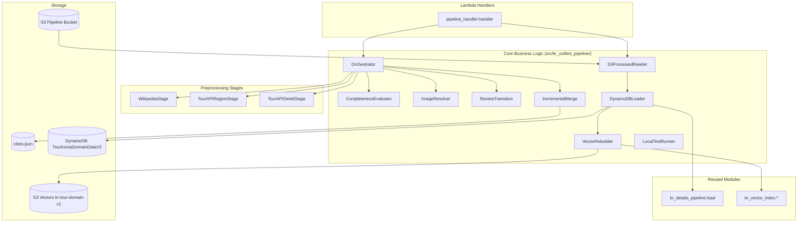

# Design Document: Unified Preprocessing Pipeline

## Overview

이 설계는 현재 분리된 세 개의 KR 전처리 모듈(Wikipedia 파이프라인, TourAPI Region Detail, TourAPI Detail Harvester)을 단일 오케스트레이터로 통합하고, 데이터 완전성 평가/리뷰 상태 전환/이미지 URL 취득 기능을 추가하며, DynamoDB 적재와 벡터 인덱스 재빌드까지 End-to-End로 실행할 수 있는 확장된 통합 파이프라인을 구현한다.

### Design Decisions

1. **Lambda 기반 아키텍처**: 기존 `src/kr_details_pipeline/`, `src/kr_vector_index/` 패턴을 따라 `src/kr_unified_pipeline/` 모듈을 생성한다. Lambda handler가 primary entry point이며, CLI는 로컬 테스트/디버깅용으로 병행 제공한다.

2. **Stage 추상화**: 각 Stage는 공통 인터페이스(`PipelineStage` Protocol)를 구현하며, `Pipeline_Context`를 입력으로 받아 갱신된 컨텍스트를 반환한다. 이로써 Stage 추가/제거가 용이하다.

3. **기존 모듈 재사용**: `kr_details_pipeline.load._write_item`, `kr_vector_index.export`, `kr_vector_index.chunks`, `kr_vector_index.embed`, `kr_vector_index.upsert`를 import하여 재사용한다. 코드 중복을 피한다.

4. **Completeness Evaluator 분리**: 데이터 완전성 평가 로직은 독립 모듈로 분리하여 단위 테스트가 용이하도록 한다.

5. **Image Resolver 계층**: Wikipedia 이미지를 primary로, TourAPI 이미지를 secondary로 관리하는 계층적 이미지 취득 전략을 채택한다.

6. **신규 DynamoDB 테이블 병행 운영**: 기존 `TourKoreaDomainData` 테이블을 유지하면서 의미 있는 GSI 명명을 가진 신규 테이블을 병행 생성한다. Terraform에서 기존 리소스를 수정하지 않는다.

7. **E2E 파이프라인 Lambda handler**: S3 processed 데이터를 입력으로 DynamoDB load → Vector rebuild를 단일 Lambda 호출로 실행한다.

## Architecture



### 실행 흐름

1. **전처리 모드** (Lambda event `command: "preprocess"`):
   - Wikipedia Stage → TourAPI Region Stage → TourAPI Detail Stage 순차 실행
   - 각 Stage 완료 후 Completeness Evaluator 평가
   - Image Resolver가 각 Stage에서 이미지 URL 수집
   - Review Transition이 불완전 레코드를 review manifest에 기록
   - 결과를 `data/KR/cities.json`에 증분 병합

2. **E2E 모드** (Lambda event `command: "e2e"` 또는 `"load"` / `"vector-build"`):
   - S3 파이프라인 버킷에서 `processed/KR/details/{ingest_date}/passed/` 읽기
   - DynamoDB TourKoreaDomainDataV2에 적재
   - Vector 인덱스 재빌드 (EntityTypeDomainIndex GSI 사용)

3. **로컬 테스트 모드** (CLI `local-test --province-id KR-42`):
   - 단일 지역으로 스코프를 제한하여 E2E 전체 흐름 검증

## Components and Interfaces

### 1. PipelineStage Protocol

```python
from typing import Protocol

class PipelineStage(Protocol):
    """통합 파이프라인의 개별 실행 단계."""

    @property
    def name(self) -> str: ...

    def execute(self, context: PipelineContext) -> PipelineContext:
        """컨텍스트를 입력받아 갱신된 컨텍스트를 반환한다."""
        ...
```

### 2. Lambda Handler (pipeline_handler.py)

```python
def handler(event: dict[str, Any], context: Any) -> dict[str, Any]:
    """
    Unified pipeline Lambda handler.

    event keys:
      - command: "preprocess" | "load" | "vector-build" | "e2e"
      - stages: list[str] (optional, for preprocess)
      - bucket: str (for E2E)
      - ingest_date: str (for E2E)
      - table_name: str (default from env DYNAMODB_TABLE)
      - province_id: str (optional, for scoping)
    """
    ...
```

### 3. CompletenessEvaluator

```python
class CompletenessEvaluator:
    REQUIRED_FIELDS = ("city_name_ko", "prefecture_id", "latitude", "longitude", "description")

    def evaluate(self, record: CityRecord) -> CompletenessResult: ...
    def compute_confidence(self, record: CityRecord) -> str: ...
```

### 4. ImageResolver

```python
class ImageResolver:
    def resolve_wikipedia_image(self, page_title: str, lang: str = "ko") -> str | None: ...
    def resolve_tourapi_image(self, detail_data: dict) -> str | None: ...
    def apply_to_record(self, record: CityRecord, source: str, url: str) -> None: ...
```

### 5. ReviewTransition

```python
class ReviewTransition:
    def transition(self, record: CityRecord, result: CompletenessResult) -> None: ...
    def upgrade_if_complete(self, record: CityRecord, result: CompletenessResult) -> None: ...
```

### 6. DynamoDBLoader

```python
class DynamoDBLoader:
    def load_from_s3(self, bucket: str, prefix: str, table_name: str) -> LoadResult: ...
```

### 7. VectorRebuilder

```python
class VectorRebuilder:
    def rebuild(self, mode: str, table_name: str) -> RebuildResult: ...
```

## Data Models

### Extended CityRecord

```python
@dataclass(slots=True)
class CityRecord(NormalizedRecord):
    city_id: str = ""
    city_name_ko: str = ""
    city_name_ja: str = ""
    city_name_en: str = ""
    prefecture_id: str = ""
    location: str = ""
    latitude: float | None = None
    longitude: float | None = None
    description: str = ""
    geography_description: str = ""
    climate_table: dict[str, str] | None = None
    site_urls: list[str] = field(default_factory=list)
    image_url: str | None = None
    image_urls: list[ImageSource] = field(default_factory=list)


@dataclass(frozen=True)
class ImageSource:
    url: str
    source: str  # "wikipedia" | "tourapi"
```

### New DynamoDB Table Schema (Terraform)

```hcl
resource "aws_dynamodb_table" "tourkorea_domain_data_v2" {
  name         = var.domain_dynamodb_table_name_v2
  billing_mode = "PAY_PER_REQUEST"
  hash_key     = "PK"
  range_key    = "SK"

  attribute { name = "PK"              type = "S" }
  attribute { name = "SK"              type = "S" }
  attribute { name = "entity_type"     type = "S" }
  attribute { name = "city_key"        type = "S" }
  attribute { name = "province_key"    type = "S" }
  attribute { name = "domain_sort_key" type = "S" }
  attribute { name = "gsi_sk"          type = "S" }

  global_secondary_index {
    name            = "CityDomainIndex"
    hash_key        = "city_key"
    range_key       = "domain_sort_key"
    projection_type = "ALL"
  }

  global_secondary_index {
    name            = "ProvinceDomainIndex"
    hash_key        = "province_key"
    range_key       = "domain_sort_key"
    projection_type = "ALL"
  }

  global_secondary_index {
    name            = "EntityTypeDomainIndex"
    hash_key        = "entity_type"
    range_key       = "domain_sort_key"
    projection_type = "ALL"
  }

  global_secondary_index {
    name            = "FestivalMonthIndex"
    hash_key        = "entity_type"
    range_key       = "gsi_sk"
    projection_type = "ALL"
  }

  point_in_time_recovery { enabled = true }
}
```

## Testing Strategy

### Unit Tests (pytest)

- CompletenessEvaluator field validation rules
- ImageResolver URL validation
- ReviewTransition state transitions
- CLI argument parsing
- Merge logic edge cases

### Property-Based Tests (Hypothesis)

Properties 3, 4, 5, 6, 7, 8, 9, 10, 11, 12, 14, 15, 16, 17 from design correctness properties.

### Integration Tests

- DynamoDB load from S3 (moto mock)
- Vector rebuild from DynamoDB GSI (moto mock)
- Wikipedia API thumbnail resolution (responses mock)

## Error Handling

| Error Type | Behavior | Recovery |
|---|---|---|
| Non-recoverable stage failure | Log error, preserve prior results | Skip remaining stages |
| Individual record failure | Log with city_id, continue | Count in summary |
| S3 read failure | Log error, skip file | Continue with other files |
| DynamoDB write failure | Log with PK/SK, skip item | Continue processing |
| Bedrock embedding failure | Log with PK/SK, skip item | Continue processing |
| Invalid image URL | Skip silently | No error raised |
