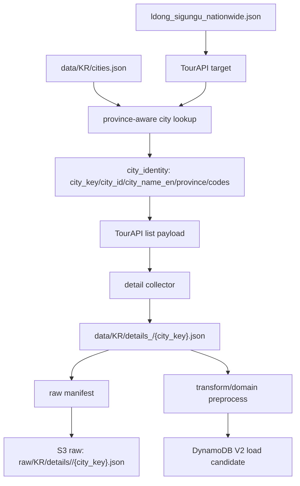

# Design Document: KR TourAPI 고유 도시 키 기반 재취득 보정

## Overview

현재 TourAPI 취득 라인은 API 요청 단계에서는 `lDongRegnCd`, `lDongSignguCd`를 사용하지만, 저장 단계에서는 `city_name_en` 단독 값을 파일명과 S3 key로 사용한다. 이 때문에 같은 영문명으로 수렴하는 동명이구는 기존 파일이 있으면 스킵되고, overwrite 실행에서는 마지막 지역이 이전 지역을 덮어쓴다.

보정 방향은 다음과 같다.

1. TourAPI target과 `cities.json`을 province-aware 방식으로 연결한다.
2. raw/detail 파일명과 S3 key는 고유 도시 키를 사용한다.
3. 표시용 이름(`city_name_en`)은 보존하되 저장 경로의 유일 키로 쓰지 않는다.
4. DataLab 방문통계 결합도 같은 city key를 공유한다.
5. 수정 파일에는 한국어 파일 헤더와 파일 이력을 적용하되, 헤더 문안은 사용자 승인 후 반영한다.

## Architecture



## Components

### 1. City identity helper

새 helper는 TourAPI target과 `cities.json` 항목을 받아 다음 값을 만든다.

- `city_key`: 저장 경로에 쓰는 고유 키
- `city_id`: 가능한 경우 `cities.json`의 `city_id`
- `city_name_en`: 표시/검색용 영문명
- `city_name_ko`: 표시용 한글명
- `province`: TourAPI `lDongRegnNm`
- `prefecture_id`: 가능한 경우 `cities.json`의 `prefecture_id`
- `lDongRegnCd`, `lDongSignguCd`

우선순위:

1. `cities.json`에서 province-aware match 성공 시 `city_id`를 `city_key`로 사용한다.
2. 실패 시 `KR-LDONG-{lDongRegnCd}-{lDongSignguCd}`를 사용한다.

### 2. TourAPI region acquisition

대상 파일:

- `crawling/KR/tour_api_region_detail_acquisition.py`
- `crawling/KR/tests/test_tour_api_region_detail_acquisition.py`

변경:

- `_load_city_name_lookup()`를 단독 `city_name_ko` lookup에서 province-aware identity lookup으로 교체한다.
- `output_path`, `list_path`는 `city_key` 기반으로 생성한다.
- 전국 대상 재취득을 위해 `ldong_sigungu_nationwide.json` 또는 region option을 명시적으로 지원한다.
- 동명이구 29개 대상의 output path 중복이 0건인지 테스트한다.

### 3. TourAPI detail collection

대상 파일:

- `crawling/KR/tour_api_city_detail_acquisition.py`
- `crawling/KR/tests/test_tour_api_city_detail_acquisition.py`

변경:

- `collect_city_detail()`은 output filename을 `meta.city_key` 또는 `meta.city_id` 기준으로 만든다.
- `city_name_en`은 fallback 표시명으로만 사용한다.
- DataLab 호출은 city identity의 행정코드/매핑 정보를 사용한다.
- output meta에는 city identity 필드를 보존한다.

### 4. DataLab visitor statistics

대상 파일:

- `crawling/KR/datalab_collector.py`
- 관련 테스트 파일

변경:

- 단일 도시 방문통계 수집이 province/city identity를 함께 받도록 확장한다.
- `signguCode` 필터가 단독 코드 충돌을 만들지 않는지 검증한다.
- 결과에 city key 추적 필드를 포함한다.

### 5. S3 raw manifest and key

대상 파일:

- `src/kr_details_pipeline/s3_keys.py`
- `src/kr_details_pipeline/manifest.py`
- `src/kr_details_pipeline/tests/test_s3_keys.py`
- `src/kr_details_pipeline/tests/test_manifest.py`

변경:

- `build_raw_detail_key()`는 기존 `city_name_en` 인자 호환을 유지하되, 호출부에서 `city_key`를 넘긴다.
- manifest record에 `city_key`를 추가한다.
- S3 key 중복 검증을 추가한다.

### 6. Transform and V2 key alignment

대상 파일:

- `src/kr_details_pipeline/transform.py`
- `src/kr_details_pipeline/tests/test_transform.py`
- 필요 시 `src/kr_details_pipeline/load.py`, `src/kr_details_pipeline/domain_preprocess.py`

변경:

- city record 생성 시 `city_key`를 보존한다.
- 동명이구의 PK/SK 후보가 `city_name_en` 단독으로 수렴하지 않도록 한다.
- 기존 소비자가 필요한 `city_name_en` 필드는 유지한다.

## Header Approval Gate

파일 헤더는 코드 적용 전에 사용자가 문안을 검토한다. 승인 전에는 Python 파일을 수정하지 않는다.

초안 원칙:

- 첫 문장은 파일의 책임을 한국어로 말한다.
- 둘째 문단은 이 파일이 취급하는 입력/출력 또는 외부 API를 말한다.
- 과도한 구현 설명은 헤더가 아니라 함수/테스트 이름에 남긴다.

## File History Policy

수정 대상 Python 파일 하단에 다음 형식을 적용한다.

```python
# 파일 이력
# 2026-06-29: TourAPI 동명이구 저장 키 충돌을 막기 위해 고유 도시 키 기반 저장/적재 흐름으로 보정했다. (github name)
```

테스트 파일에는 다음 형식을 적용한다.

```python
# 파일 이력
# 2026-06-29: 동명이구 고유 도시 키와 S3 key 중복 방지 검증을 추가했다. (github name)
```

실제 코드 적용 시 `(github name)` 자리에는 작업자의 GitHub name을 넣는다.

## Verification Strategy

단위 테스트:

```powershell
uv run pytest crawling/KR/tests/test_tour_api_region_detail_acquisition.py crawling/KR/tests/test_tour_api_city_detail_acquisition.py src/kr_details_pipeline/tests/test_s3_keys.py src/kr_details_pipeline/tests/test_manifest.py src/kr_details_pipeline/tests/test_transform.py
```

Smoke 검증:

1. 서울 중구와 울산 중구가 서로 다른 파일명으로 생성되는지 확인한다.
2. 강원 고성군과 경남 고성군이 서로 다른 파일명으로 생성되는지 확인한다.
3. 각 파일의 `meta.city_key`, `meta.city_id`, `meta.province`, `meta.city_name_en`, `meta.lDongRegnCd`, `meta.lDongSignguCd`를 확인한다.
4. S3 manifest에서 key 중복이 0건인지 확인한다.

## Risks

- `cities.json`의 province 표기와 TourAPI `lDongRegnNm` 표기가 다르므로 normalization table이 필요할 수 있다.
- DynamoDB V2 기존 PK 구조와 호환성을 고려해야 한다.
- DataLab 공식 `signguCode`와 legal-dong code가 완전히 동일하지 않을 수 있으므로 매핑 검증이 필요하다.
- 전국 재취득은 API quota를 소모하므로 smoke 검증 없이 바로 실행하지 않는다.

## Change History

- 2026-06-29: TourAPI raw/detail, DataLab, S3 raw, V2 key 정합성 보정 설계를 추가했다. (github name)
